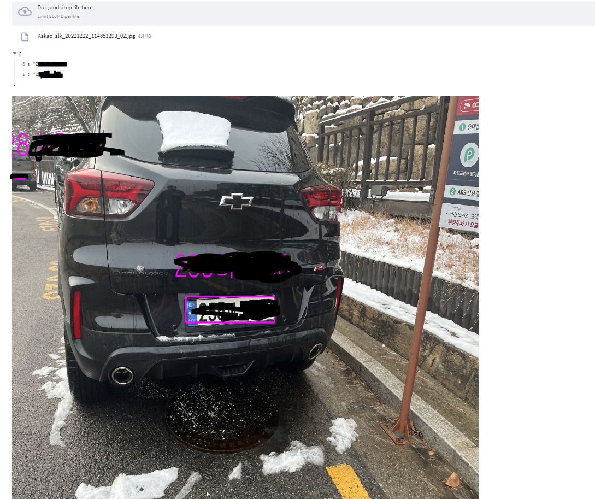
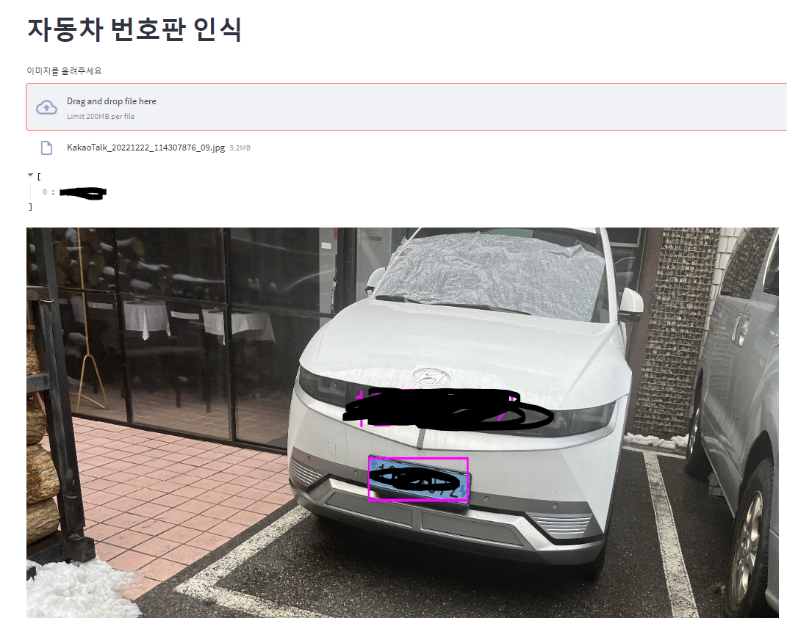
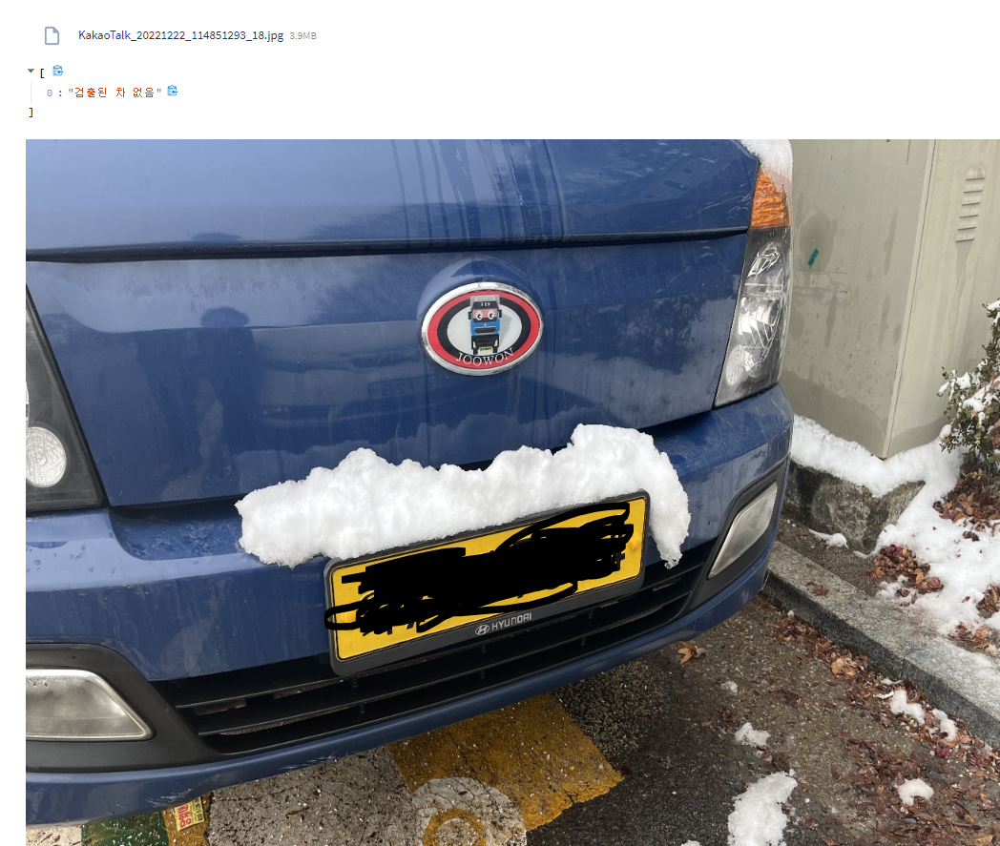

# EasyKoreanLpDetector

English | [Korean](README-KOR.md)


I am releasing this repository because there are no other options that work great on Korean license plates. Please give it a star if you find it helpful.

## Algorithm

Input Image -> Detect cars -> Detect Korean License Plate in Car  -> OCR

## requirements  
yolov5, streamlit, easyocr, pytorch, opencv, numpy.

You can download all libraries using pip. If an error occurs, try downloading with pip again.

All weights are included in the project, so size of this repository is about 50 MB. You don't need to download anything extra.


## Steps to run

1. Download repo with git clone https://github.com/gyupro/EasyKoreanLpDetector/  
2. run streamlit server with streamlit run server.py 

```bash
git clone https://github.com/gyupro/EasyKoreanLpDetector/
cd EasyKoreanLpDetector
streamlit run server.py
```

 
|Good examples|Good examples|Bad example|
|----|----|----|
||||  
||||

### Trained On :
* This trained on [AIHUB dataset](https://aihub.or.kr/aihubdata/data/view.do?currMenu=115&topMenu=100&aihubDataSe=realm&dataSetSn=172)
* OCR is trained on 80,000 license plate - character set
* License plate detection is trained on synthetic data that was generated by AIHUB dataset (Dataset provides a blurred license plate on a car, I replaced a blurred area with cropped plates)


### Advantages :
* This project works better than other open-source projects on GitHub.
* It has the easiest code of all projects on GitHub.
*It is fast when you have a GPU.
* You can improve performance by training.
* It works well with 4K images taken from a phone.

### Limitations :
* The train is not perfectly done, Original yolov5 model is used to detect a car so that it does not perform well when a car is close to the camera
* Old license plates may not be easily recognizable, but compared to older ones, newer ones are more easily recognizable.

## References

* [https://github.com/ultralytics/yolov5](https://github.com/ultralytics/yolov5)

* [https://github.com/JaidedAI/EasyOCR](https://github.com/JaidedAI/EasyOCR)
