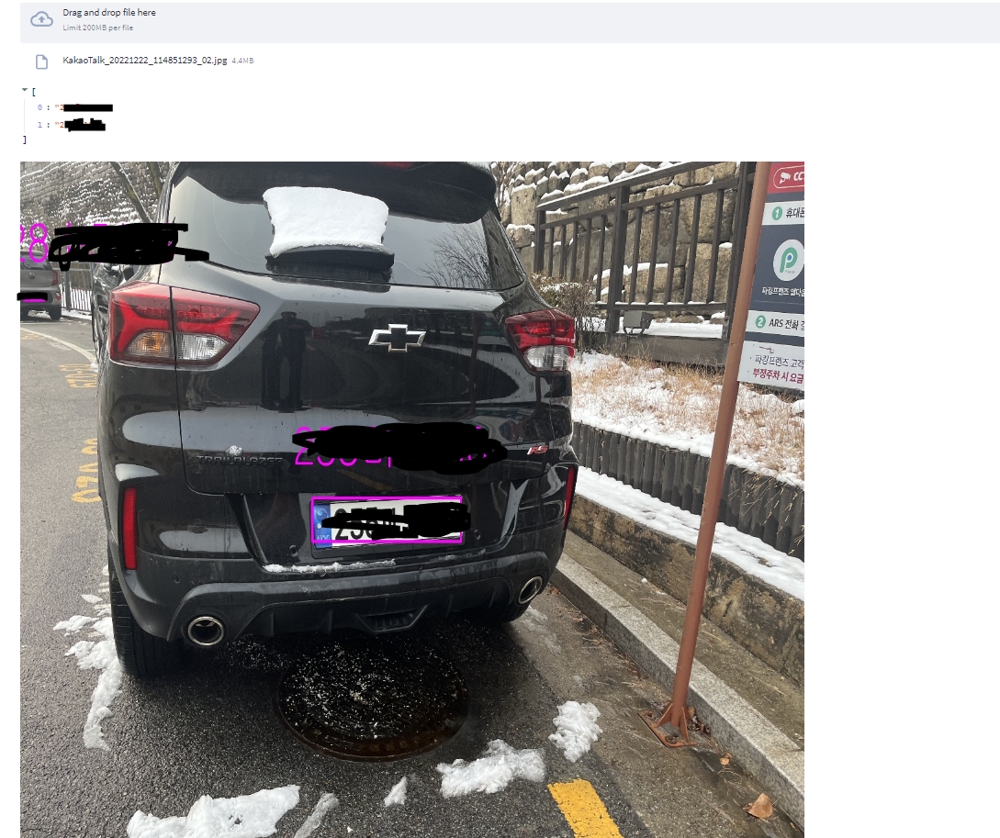
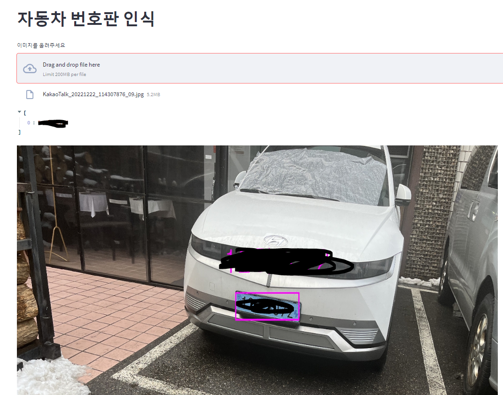
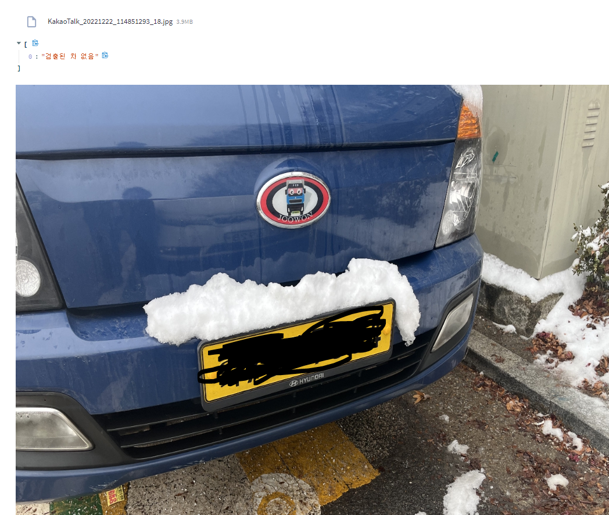

# EasyKoreanLpDetector

English | [Korean](README-KOR.md)


I am releasing this repository because there are no other options that work great on Korean license plates. Please give it a star if you find it helpful.

## Algorithm

Input Image -> Detect cars -> Detect Korean License Plate in Car  -> OCR

## Requirements

All weights are included in the project (~50 MB). No extra downloads needed.

**pip**
```bash
pip install -r requirements.txt
```

**uv (recommended)**
```bash
uv venv --python 3.11
uv pip install -r requirements-uv.txt --index-url https://download.pytorch.org/whl/cpu
```

## Steps to run

```bash
git clone https://github.com/gyupro/EasyKoreanLpDetector/
cd EasyKoreanLpDetector
streamlit run server.py --server.headless true
```

 
|Good examples|Good examples|Bad example|
|----|----|----|
||||  
||||

### Trained On :
* This trained on [AIHUB dataset](https://aihub.or.kr/aihubdata/data/view.do?currMenu=115&topMenu=100&aihubDataSe=realm&dataSetSn=172)
* OCR is trained on 80,000 license plate - character set
* License plate detection is trained on synthetic data that was generated by AIHUB dataset (Dataset provides a blurred license plate on a car, I replaced a blurred area with cropped plates)


### Advantages :
* This project works better than other open-source projects on GitHub.
* It has the easiest code of all projects on GitHub.
*It is fast when you have a GPU.
* You can improve performance by training.
* It works well with 4K images taken from a phone.

### Limitations :
* The train is not perfectly done, Original yolov5 model is used to detect a car so that it does not perform well when a car is close to the camera
* Old license plates may not be easily recognizable, but compared to older ones, newer ones are more easily recognizable.

## References

* [https://github.com/ultralytics/yolov5](https://github.com/ultralytics/yolov5)

* [https://github.com/JaidedAI/EasyOCR](https://github.com/JaidedAI/EasyOCR)
